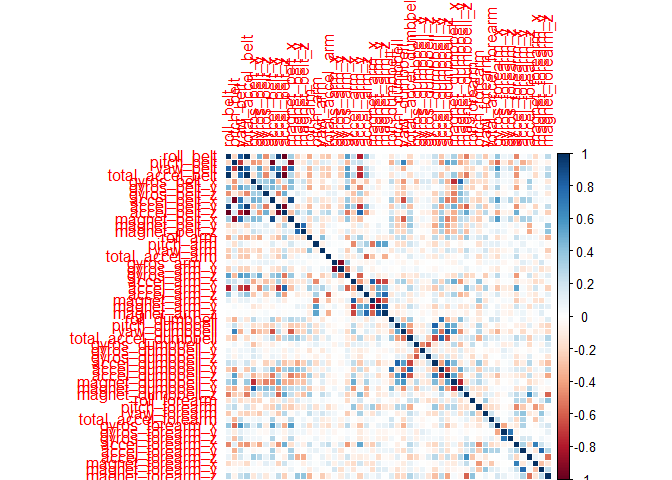
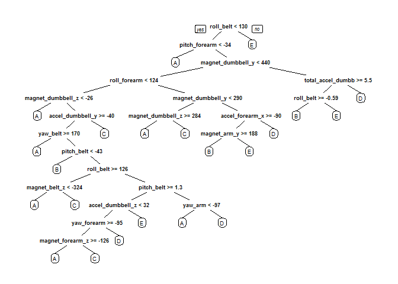

# Coursera PML Project
Chisung Song  
Monday, November 23, 2015  

<style>


</style>


<br><br><br>  
<hr>
## Project Introduction
<hr>
- Using devices such as Jawbone Up, Nike FuelBand, and Fitbit it is now possible to collect a large amount of data about personal activity relatively inexpensively. These type of devices are part of the quantified self movement – a group of enthusiasts who take measurements about themselves regularly to improve their health, to find patterns in their behavior, or because they are tech geeks. One thing that people regularly do is quantify how much of a particular activity they do, but they rarely quantify how well they do it.   
- In this project, your goal will be to use data from accelerometers on the belt, forearm, arm, and dumbell of 6 participants. They were asked to perform barbell lifts correctly and incorrectly in 5 different ways.  
- More information is available from the website here: http://groupware.les.inf.puc-rio.br/har (see the section on the Weight Lifting Exercise Dataset). 

<br><br><br>  
<hr>
## Data Preprocessing  
<hr>

### Load some packages

```r
#install.packages("caret")
#install.packages("rpart")
#install.packages("rpart.plot")
#install.packages("randomForest")
#install.packages("corrplot")
library(caret)
```

```
## Loading required package: lattice
## Loading required package: ggplot2
```

```r
library(rpart)
library(rpart.plot)
library(randomForest)
```

```
## randomForest 4.6-12
## Type rfNews() to see new features/changes/bug fixes.
```

```r
library(corrplot)
```


### Download the Data

```r
trainUrl <-"https://d396qusza40orc.cloudfront.net/predmachlearn/pml-training.csv"
testUrl <- "https://d396qusza40orc.cloudfront.net/predmachlearn/pml-testing.csv"
trainFile <- "./data/pml-training.csv"
testFile  <- "./data/pml-testing.csv"
if (!file.exists("./data")) {
  dir.create("./data")
}
if (!file.exists(trainFile)) {
  download.file(trainUrl, destfile=trainFile, method="curl")
}
if (!file.exists(testFile)) {
  download.file(testUrl, destfile=testFile, method="curl")
}
```
<br><br>
### Read the Data
After downloading the data from the data source, we can read the two csv files into two data frames.  

```r
trainRaw <- read.csv("./data/pml-training.csv")
testRaw <- read.csv("./data/pml-testing.csv")
head(trainRaw) # -> There are so many "NA"s
```

```
##   X user_name raw_timestamp_part_1 raw_timestamp_part_2   cvtd_timestamp
## 1 1  carlitos           1323084231               788290 05/12/2011 11:23
## 2 2  carlitos           1323084231               808298 05/12/2011 11:23
## 3 3  carlitos           1323084231               820366 05/12/2011 11:23
## 4 4  carlitos           1323084232               120339 05/12/2011 11:23
## 5 5  carlitos           1323084232               196328 05/12/2011 11:23
## 6 6  carlitos           1323084232               304277 05/12/2011 11:23
##   new_window num_window roll_belt pitch_belt yaw_belt total_accel_belt
## 1         no         11      1.41       8.07    -94.4                3
## 2         no         11      1.41       8.07    -94.4                3
## 3         no         11      1.42       8.07    -94.4                3
## 4         no         12      1.48       8.05    -94.4                3
## 5         no         12      1.48       8.07    -94.4                3
## 6         no         12      1.45       8.06    -94.4                3
##   kurtosis_roll_belt kurtosis_picth_belt kurtosis_yaw_belt
## 1                                                         
## 2                                                         
## 3                                                         
## 4                                                         
## 5                                                         
## 6                                                         
##   skewness_roll_belt skewness_roll_belt.1 skewness_yaw_belt max_roll_belt
## 1                                                                      NA
## 2                                                                      NA
## 3                                                                      NA
## 4                                                                      NA
## 5                                                                      NA
## 6                                                                      NA
##   max_picth_belt max_yaw_belt min_roll_belt min_pitch_belt min_yaw_belt
## 1             NA                         NA             NA             
## 2             NA                         NA             NA             
## 3             NA                         NA             NA             
## 4             NA                         NA             NA             
## 5             NA                         NA             NA             
## 6             NA                         NA             NA             
##   amplitude_roll_belt amplitude_pitch_belt amplitude_yaw_belt
## 1                  NA                   NA                   
## 2                  NA                   NA                   
## 3                  NA                   NA                   
## 4                  NA                   NA                   
## 5                  NA                   NA                   
## 6                  NA                   NA                   
##   var_total_accel_belt avg_roll_belt stddev_roll_belt var_roll_belt
## 1                   NA            NA               NA            NA
## 2                   NA            NA               NA            NA
## 3                   NA            NA               NA            NA
## 4                   NA            NA               NA            NA
## 5                   NA            NA               NA            NA
## 6                   NA            NA               NA            NA
##   avg_pitch_belt stddev_pitch_belt var_pitch_belt avg_yaw_belt
## 1             NA                NA             NA           NA
## 2             NA                NA             NA           NA
## 3             NA                NA             NA           NA
## 4             NA                NA             NA           NA
## 5             NA                NA             NA           NA
## 6             NA                NA             NA           NA
##   stddev_yaw_belt var_yaw_belt gyros_belt_x gyros_belt_y gyros_belt_z
## 1              NA           NA         0.00         0.00        -0.02
## 2              NA           NA         0.02         0.00        -0.02
## 3              NA           NA         0.00         0.00        -0.02
## 4              NA           NA         0.02         0.00        -0.03
## 5              NA           NA         0.02         0.02        -0.02
## 6              NA           NA         0.02         0.00        -0.02
##   accel_belt_x accel_belt_y accel_belt_z magnet_belt_x magnet_belt_y
## 1          -21            4           22            -3           599
## 2          -22            4           22            -7           608
## 3          -20            5           23            -2           600
## 4          -22            3           21            -6           604
## 5          -21            2           24            -6           600
## 6          -21            4           21             0           603
##   magnet_belt_z roll_arm pitch_arm yaw_arm total_accel_arm var_accel_arm
## 1          -313     -128      22.5    -161              34            NA
## 2          -311     -128      22.5    -161              34            NA
## 3          -305     -128      22.5    -161              34            NA
## 4          -310     -128      22.1    -161              34            NA
## 5          -302     -128      22.1    -161              34            NA
## 6          -312     -128      22.0    -161              34            NA
##   avg_roll_arm stddev_roll_arm var_roll_arm avg_pitch_arm stddev_pitch_arm
## 1           NA              NA           NA            NA               NA
## 2           NA              NA           NA            NA               NA
## 3           NA              NA           NA            NA               NA
## 4           NA              NA           NA            NA               NA
## 5           NA              NA           NA            NA               NA
## 6           NA              NA           NA            NA               NA
##   var_pitch_arm avg_yaw_arm stddev_yaw_arm var_yaw_arm gyros_arm_x
## 1            NA          NA             NA          NA        0.00
## 2            NA          NA             NA          NA        0.02
## 3            NA          NA             NA          NA        0.02
## 4            NA          NA             NA          NA        0.02
## 5            NA          NA             NA          NA        0.00
## 6            NA          NA             NA          NA        0.02
##   gyros_arm_y gyros_arm_z accel_arm_x accel_arm_y accel_arm_z magnet_arm_x
## 1        0.00       -0.02        -288         109        -123         -368
## 2       -0.02       -0.02        -290         110        -125         -369
## 3       -0.02       -0.02        -289         110        -126         -368
## 4       -0.03        0.02        -289         111        -123         -372
## 5       -0.03        0.00        -289         111        -123         -374
## 6       -0.03        0.00        -289         111        -122         -369
##   magnet_arm_y magnet_arm_z kurtosis_roll_arm kurtosis_picth_arm
## 1          337          516                                     
## 2          337          513                                     
## 3          344          513                                     
## 4          344          512                                     
## 5          337          506                                     
## 6          342          513                                     
##   kurtosis_yaw_arm skewness_roll_arm skewness_pitch_arm skewness_yaw_arm
## 1                                                                       
## 2                                                                       
## 3                                                                       
## 4                                                                       
## 5                                                                       
## 6                                                                       
##   max_roll_arm max_picth_arm max_yaw_arm min_roll_arm min_pitch_arm
## 1           NA            NA          NA           NA            NA
## 2           NA            NA          NA           NA            NA
## 3           NA            NA          NA           NA            NA
## 4           NA            NA          NA           NA            NA
## 5           NA            NA          NA           NA            NA
## 6           NA            NA          NA           NA            NA
##   min_yaw_arm amplitude_roll_arm amplitude_pitch_arm amplitude_yaw_arm
## 1          NA                 NA                  NA                NA
## 2          NA                 NA                  NA                NA
## 3          NA                 NA                  NA                NA
## 4          NA                 NA                  NA                NA
## 5          NA                 NA                  NA                NA
## 6          NA                 NA                  NA                NA
##   roll_dumbbell pitch_dumbbell yaw_dumbbell kurtosis_roll_dumbbell
## 1      13.05217      -70.49400    -84.87394                       
## 2      13.13074      -70.63751    -84.71065                       
## 3      12.85075      -70.27812    -85.14078                       
## 4      13.43120      -70.39379    -84.87363                       
## 5      13.37872      -70.42856    -84.85306                       
## 6      13.38246      -70.81759    -84.46500                       
##   kurtosis_picth_dumbbell kurtosis_yaw_dumbbell skewness_roll_dumbbell
## 1                                                                     
## 2                                                                     
## 3                                                                     
## 4                                                                     
## 5                                                                     
## 6                                                                     
##   skewness_pitch_dumbbell skewness_yaw_dumbbell max_roll_dumbbell
## 1                                                              NA
## 2                                                              NA
## 3                                                              NA
## 4                                                              NA
## 5                                                              NA
## 6                                                              NA
##   max_picth_dumbbell max_yaw_dumbbell min_roll_dumbbell min_pitch_dumbbell
## 1                 NA                                 NA                 NA
## 2                 NA                                 NA                 NA
## 3                 NA                                 NA                 NA
## 4                 NA                                 NA                 NA
## 5                 NA                                 NA                 NA
## 6                 NA                                 NA                 NA
##   min_yaw_dumbbell amplitude_roll_dumbbell amplitude_pitch_dumbbell
## 1                                       NA                       NA
## 2                                       NA                       NA
## 3                                       NA                       NA
## 4                                       NA                       NA
## 5                                       NA                       NA
## 6                                       NA                       NA
##   amplitude_yaw_dumbbell total_accel_dumbbell var_accel_dumbbell
## 1                                          37                 NA
## 2                                          37                 NA
## 3                                          37                 NA
## 4                                          37                 NA
## 5                                          37                 NA
## 6                                          37                 NA
##   avg_roll_dumbbell stddev_roll_dumbbell var_roll_dumbbell
## 1                NA                   NA                NA
## 2                NA                   NA                NA
## 3                NA                   NA                NA
## 4                NA                   NA                NA
## 5                NA                   NA                NA
## 6                NA                   NA                NA
##   avg_pitch_dumbbell stddev_pitch_dumbbell var_pitch_dumbbell
## 1                 NA                    NA                 NA
## 2                 NA                    NA                 NA
## 3                 NA                    NA                 NA
## 4                 NA                    NA                 NA
## 5                 NA                    NA                 NA
## 6                 NA                    NA                 NA
##   avg_yaw_dumbbell stddev_yaw_dumbbell var_yaw_dumbbell gyros_dumbbell_x
## 1               NA                  NA               NA                0
## 2               NA                  NA               NA                0
## 3               NA                  NA               NA                0
## 4               NA                  NA               NA                0
## 5               NA                  NA               NA                0
## 6               NA                  NA               NA                0
##   gyros_dumbbell_y gyros_dumbbell_z accel_dumbbell_x accel_dumbbell_y
## 1            -0.02             0.00             -234               47
## 2            -0.02             0.00             -233               47
## 3            -0.02             0.00             -232               46
## 4            -0.02            -0.02             -232               48
## 5            -0.02             0.00             -233               48
## 6            -0.02             0.00             -234               48
##   accel_dumbbell_z magnet_dumbbell_x magnet_dumbbell_y magnet_dumbbell_z
## 1             -271              -559               293               -65
## 2             -269              -555               296               -64
## 3             -270              -561               298               -63
## 4             -269              -552               303               -60
## 5             -270              -554               292               -68
## 6             -269              -558               294               -66
##   roll_forearm pitch_forearm yaw_forearm kurtosis_roll_forearm
## 1         28.4         -63.9        -153                      
## 2         28.3         -63.9        -153                      
## 3         28.3         -63.9        -152                      
## 4         28.1         -63.9        -152                      
## 5         28.0         -63.9        -152                      
## 6         27.9         -63.9        -152                      
##   kurtosis_picth_forearm kurtosis_yaw_forearm skewness_roll_forearm
## 1                                                                  
## 2                                                                  
## 3                                                                  
## 4                                                                  
## 5                                                                  
## 6                                                                  
##   skewness_pitch_forearm skewness_yaw_forearm max_roll_forearm
## 1                                                           NA
## 2                                                           NA
## 3                                                           NA
## 4                                                           NA
## 5                                                           NA
## 6                                                           NA
##   max_picth_forearm max_yaw_forearm min_roll_forearm min_pitch_forearm
## 1                NA                               NA                NA
## 2                NA                               NA                NA
## 3                NA                               NA                NA
## 4                NA                               NA                NA
## 5                NA                               NA                NA
## 6                NA                               NA                NA
##   min_yaw_forearm amplitude_roll_forearm amplitude_pitch_forearm
## 1                                     NA                      NA
## 2                                     NA                      NA
## 3                                     NA                      NA
## 4                                     NA                      NA
## 5                                     NA                      NA
## 6                                     NA                      NA
##   amplitude_yaw_forearm total_accel_forearm var_accel_forearm
## 1                                        36                NA
## 2                                        36                NA
## 3                                        36                NA
## 4                                        36                NA
## 5                                        36                NA
## 6                                        36                NA
##   avg_roll_forearm stddev_roll_forearm var_roll_forearm avg_pitch_forearm
## 1               NA                  NA               NA                NA
## 2               NA                  NA               NA                NA
## 3               NA                  NA               NA                NA
## 4               NA                  NA               NA                NA
## 5               NA                  NA               NA                NA
## 6               NA                  NA               NA                NA
##   stddev_pitch_forearm var_pitch_forearm avg_yaw_forearm
## 1                   NA                NA              NA
## 2                   NA                NA              NA
## 3                   NA                NA              NA
## 4                   NA                NA              NA
## 5                   NA                NA              NA
## 6                   NA                NA              NA
##   stddev_yaw_forearm var_yaw_forearm gyros_forearm_x gyros_forearm_y
## 1                 NA              NA            0.03            0.00
## 2                 NA              NA            0.02            0.00
## 3                 NA              NA            0.03           -0.02
## 4                 NA              NA            0.02           -0.02
## 5                 NA              NA            0.02            0.00
## 6                 NA              NA            0.02           -0.02
##   gyros_forearm_z accel_forearm_x accel_forearm_y accel_forearm_z
## 1           -0.02             192             203            -215
## 2           -0.02             192             203            -216
## 3            0.00             196             204            -213
## 4            0.00             189             206            -214
## 5           -0.02             189             206            -214
## 6           -0.03             193             203            -215
##   magnet_forearm_x magnet_forearm_y magnet_forearm_z classe
## 1              -17              654              476      A
## 2              -18              661              473      A
## 3              -18              658              469      A
## 4              -16              658              469      A
## 5              -17              655              473      A
## 6               -9              660              478      A
```

```r
dim(trainRaw)
```

```
## [1] 19622   160
```

```r
dim(testRaw)
```

```
## [1]  20 160
```
The training data set contains 19622 observations and 160 variables, while the testing data set contains 20 observations and 160 variables. The "classe" variable in the training set is the outcome to predict.  
<br><br>    
### Clean the data
In this step, we will clean the data and get rid of observations with missing values as well as some meaningless variables.  

```r
sum(complete.cases(trainRaw))
```

```
## [1] 406
```
First, we remove columns that contain NA missing values.

```r
trainTemp <- trainRaw[, colSums(is.na(trainRaw)) == 0] 
testTemp <- testRaw[, colSums(is.na(testRaw)) == 0] 
dim(trainTemp) # Almost half variables removed
```

```
## [1] 19622    93
```
Next, we get rid of some columns that do not contribute much to the accelerometer measurements.

```r
classe <- trainTemp$classe
trainRemove <- grepl("^X|timestamp|window", names(trainTemp))
trainTemp <- trainTemp[,!trainRemove]
trainCleaned <- trainTemp[, sapply(trainTemp, is.numeric)]
trainCleaned$classe <- classe
testRemove <- grepl("^X|timestamp|window", names(testTemp))
testTemp <- testTemp[, !testRemove]
testCleaned <- testTemp[, sapply(testTemp, is.numeric)]
```
Now, the cleaned training data set contains 19622 observations and 53 variables, while the testing data set contains 20 observations and 53 variables. The "classe" variable is still in the cleaned training set.
<br><br>
### Slice the data
Then, we can split the cleaned training set into a pure training data set (70%) and a validation data set (30%). We will use the validation data set to conduct cross validation in future steps.

```r
set.seed(1122) # For reproducibile purpose
inTrain <- createDataPartition(trainCleaned$classe, p=0.70, list=F)
trainData <- trainCleaned[inTrain, ]
testData <- trainCleaned[-inTrain, ]
```


<br><br><br>  
<hr>
## Data Modeling 
<hr>
We fit a predictive model for activity recognition using <b>Random Forest algorithm because it automatically selects important variables and is robust to correlated covariates & outliers in general.</b> We will use <b>5-fold cross validation</b> when applying the algorithm.

```r
controlRf <- trainControl(method="cv", 5)
# method : Random Forest
modelRf <- train(classe ~ ., data=trainData, method="rf", trControl=controlRf, ntree=250)
modelRf
```

```
## Random Forest 
## 
## 13737 samples
##    52 predictor
##     5 classes: 'A', 'B', 'C', 'D', 'E' 
## 
## No pre-processing
## Resampling: Cross-Validated (5 fold) 
## Summary of sample sizes: 10991, 10989, 10987, 10991, 10990 
## Resampling results across tuning parameters:
## 
##   mtry  Accuracy   Kappa      Accuracy SD  Kappa SD   
##    2    0.9901720  0.9875663  0.003037009  0.003843290
##   27    0.9918472  0.9896861  0.001076043  0.001360054
##   52    0.9841308  0.9799232  0.003093048  0.003916797
## 
## Accuracy was used to select the optimal model using  the largest value.
## The final value used for the model was mtry = 27.
```
Then, we estimate the performance of the model on the validation data set.

```r
predictRf <- predict(modelRf, testData)
confusionMatrix(testData$classe, predictRf)
```

```
## Confusion Matrix and Statistics
## 
##           Reference
## Prediction    A    B    C    D    E
##          A 1672    1    0    0    1
##          B   13 1124    2    0    0
##          C    0    6 1014    6    0
##          D    0    0    5  955    4
##          E    0    1    3    2 1076
## 
## Overall Statistics
##                                         
##                Accuracy : 0.9925        
##                  95% CI : (0.99, 0.9946)
##     No Information Rate : 0.2863        
##     P-Value [Acc > NIR] : < 2.2e-16     
##                                         
##                   Kappa : 0.9905        
##  Mcnemar's Test P-Value : NA            
## 
## Statistics by Class:
## 
##                      Class: A Class: B Class: C Class: D Class: E
## Sensitivity            0.9923   0.9929   0.9902   0.9917   0.9954
## Specificity            0.9995   0.9968   0.9975   0.9982   0.9988
## Pos Pred Value         0.9988   0.9868   0.9883   0.9907   0.9945
## Neg Pred Value         0.9969   0.9983   0.9979   0.9984   0.9990
## Prevalence             0.2863   0.1924   0.1740   0.1636   0.1837
## Detection Rate         0.2841   0.1910   0.1723   0.1623   0.1828
## Detection Prevalence   0.2845   0.1935   0.1743   0.1638   0.1839
## Balanced Accuracy      0.9959   0.9949   0.9939   0.9949   0.9971
```

```r
accuracy <- postResample(predictRf, testData$classe)
accuracy
```

```
##  Accuracy     Kappa 
## 0.9925234 0.9905409
```

```r
oose <- 1 - as.numeric(confusionMatrix(testData$classe, predictRf)$overall[1])
oose
```

```
## [1] 0.007476636
```
So, the estimated accuracy of the model is 99.21% and the estimated out-of-sample error is 0.78%.

<br><br><br>  
<hr>
## Predicting for Test Data Set
<hr>
Now, we apply the model to the original testing data set downloaded from the data source. We remove the problem_id column first.

```r
result <- predict(modelRf, testCleaned[, -length(names(testCleaned))])
result
```

```
##  [1] B A B A A E D B A A B C B A E E A B B B
## Levels: A B C D E
```

<br><br><br>  
<hr>
## Appendix: Figures
<hr>

1. Correlation Matrix Visualization

```r
corrPlot <- cor(trainData[, -length(names(trainData))])
corrplot(corrPlot, method="color")
```

 

2. Decision Tree Visualization

```r
treeModel <- rpart(classe ~ ., data=trainData, method="class")
prp(treeModel) # fast plot
```

 

